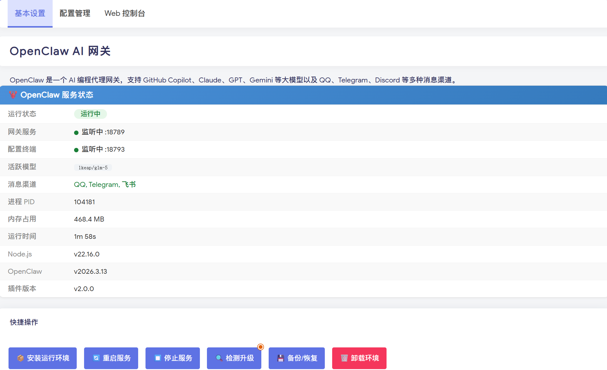

# OpenClaw ImmortalWrt 插件

[](https://space.bilibili.com/59438380)
[](https://blog.910501.xyz/)
[](https://github.com/xmlct7871/luci-app-openclaw/actions/workflows/build.yml)
[](LICENSE)

[OpenClaw](https://github.com/openclaw/openclaw) AI 网关的 LuCI 管理插件，专为 **ImmortalWrt** 系统适配，安装路径与上游 OpenClaw 默认布局对齐。

> OpenClaw 后续版本升级无需重新适配本插件——安装路径与 upstream OpenClaw 在 `root` 用户下的默认路径（`/root/.openclaw`）完全一致。

<div align="center">
  
</div>

## 系统要求

| 项目 | 要求 |
|------|------|
| 架构 | x86_64 或 aarch64 (ARM64) |
| C 库 | musl（自动检测；离线包仅支持 musl） |
| 依赖 | luci-compat, luci-base, curl, openssl-util, tar, script-utils |
| 存储 | **2GB 以上可用空间** |
| 内存 | 推荐 1GB 及以上 |

## 适配版本

| 组件 | 默认版本 | 说明 |
|------|----------|------|
| OpenClaw ImmortalWrt 插件 | `v1.0.1` | 详见 [CHANGELOG](CHANGELOG.md) |
| OpenClaw（上游 npm 包） | `2026.6.10`（可自由升级） | 目录布局与 upstream 默认一致，后续任意 OpenClaw 版本升级无需重新适配本插件 |
| 适配目标系统 | ImmortalWrt（兼容 OpenWrt / iStoreOS） | 路径与 procd 行为按 ImmortalWrt 惯例校准 |
| Node.js | `24.15.0` | OpenClaw 2026.6.x 要求 `>=22.19.0`；安装后会按 `engines.node` 做强校验，低于要求会直接失败 |
| 微信插件 | `@tencent-weixin/openclaw-weixin@2.4.3` | CLI 使用 `@tencent-weixin/openclaw-weixin-cli@2.1.4` |

## 📦 安装

> **ImmortalWrt 25.12+ 已将默认包管理器从 opkg 切换为 apk。** 本仓库同步发布两套安装包，按系统版本选择：
>
> | 包名 | 文件 | 适用系统 | 包管理器 |
> |------|------|----------|----------|
> | `luci-app-openclaw` | `luci-app-openclaw_${VER}-1_all.ipk` | ImmortalWrt < 25.12 / OpenWrt / iStoreOS | opkg |
> | `luci-app-openclaw-apk` | `luci-app-openclaw-apk_${VER}-1_all.apk` | ImmortalWrt 25.12+ | apk |
>
> 两套包文件内容完全一致，**包名刻意区分**（`-apk` 后缀），避免在同一系统中产生冲突或歧义。

### 方式一：.run 自解压包（推荐）

无需 SDK，适用于已安装好的系统。

```bash
# 下载最新版本（自动获取版本号）
VER=$(curl -sI "https://github.com/xmlct7871/luci-app-openclaw/releases/latest" 2>/dev/null | grep -i "location:" | sed 's/.*tag\/v\{0,1\}//' | tr -d '\r\n')
wget "https://github.com/xmlct7871/luci-app-openclaw/releases/download/v${VER}/luci-app-openclaw_${VER}.run"
sh "luci-app-openclaw_${VER}.run"
```

### 方式二：.ipk 安装（opkg / ImmortalWrt < 25.12）

```bash
# 下载最新版本（自动获取版本号）
VER=$(curl -sI "https://github.com/xmlct7871/luci-app-openclaw/releases/latest" 2>/dev/null | grep -i "location:" | sed 's/.*tag\/v\{0,1\}//' | tr -d '\r\n')
wget "https://github.com/xmlct7871/luci-app-openclaw/releases/download/v${VER}/luci-app-openclaw_${VER}-1_all.ipk"
opkg install "luci-app-openclaw_${VER}-1_all.ipk"
```

### 方式二点五：.apk 安装（ImmortalWrt 25.12+）

```bash
# 下载最新版本（自动获取版本号）
VER=$(curl -sI "https://github.com/xmlct7871/luci-app-openclaw/releases/latest" 2>/dev/null | grep -i "location:" | sed 's/.*tag\/v\{0,1\}//' | tr -d '\r\n')
wget "https://github.com/xmlct7871/luci-app-openclaw/releases/download/v${VER}/luci-app-openclaw-apk_${VER}-1_all.apk"
apk add --allow-untrusted "luci-app-openclaw-apk_${VER}-1_all.apk"
```

卸载：

```bash
apk del luci-app-openclaw-apk
```

### 方式三：集成到固件编译

适用于自行编译固件或使用在线编译平台的用户。

```bash
cd /path/to/openwrt

# 添加 feeds
echo "src-git openclaw https://github.com/xmlct7871/luci-app-openclaw.git" >> feeds.conf.default

# 更新安装
./scripts/feeds update -a
./scripts/feeds install -a

# 选择插件
make menuconfig
# LuCI → Applications → luci-app-openclaw

# 编译
make package/luci-app-openclaw/compile V=s
```

使用 OpenWrt SDK 单独编译：

```bash
git clone https://github.com/xmlct7871/luci-app-openclaw.git package/luci-app-openclaw
make defconfig
make package/luci-app-openclaw/compile V=s
find bin/ -name "luci-app-openclaw*.ipk"
```


## 🔰 首次使用

1. 打开 LuCI → 服务 → OpenClaw，点击「安装运行环境」
2. 安装完成后服务会自动启动，点击「刷新页面」查看状态
3. 在「基本设置」点击「Web 控制台」添加 AI 模型和 API Key
4. SSH 登录系统，运行 `openclaw config` 在终端配置消息渠道（QQ / Telegram / Discord 等）

默认安装路径是 `/root/.openclaw`。

## 自定义安装路径

UCI 字段是 `openclaw.main.install_path`，本版语义为 **state dir 自身**——所填路径就是 OpenClaw state dir 的根目录，脚本不会在其下再加一层 `openclaw/` 包装。例如：

```bash
uci set openclaw.main.install_path='/mnt/data/openclaw'
uci commit openclaw
openclaw-env setup
```

实际运行目录就是 `/mnt/data/openclaw`（直接）。插件不会做 `/xxx/openclaw` 包装。

外置盘场景推荐：把整个 OpenClaw 装到 `/mnt/sda1/openclaw` 这样的子目录，备份时直接 `tar` 整目录。

安装前会执行写入探针；如果 overlay 已满、只读或外置盘未正确挂载，安装会在下载前失败并给出明确日志。如果 `/opt` 或 `/root` 在 iStoreOS Docker bind mount 下不可写，`_oc_fix_overlay` 会自动 bind mount `/overlay/upper/<base>` 修复；最坏情况下会 fallback 到 `/tmp/openclaw-fallback-$$`。

## 微信插件依赖

本版微信插件以 **root** 身份运行。安装前会检查：

- `python3` 是否已安装
- `${install_path}/extensions/`、`${install_path}/.npm/`、`${install_path}/.tmp/` 等目录可写（以 root 跑天然满足）
- 旧渠道名 `weixin` 会迁移为 `openclaw-weixin`

如缺少 Python3：

```bash
opkg update
opkg install python3
```

## 已知说明

- OpenClaw 的 diagnostic heartbeat 可能在日志中出现类似周期性探测记录。它不是一次真实用户对话请求；如需降低噪音，优先在 OpenClaw 配置或日志采集侧降低诊断日志级别，不建议直接修改模型调用逻辑。
- 当前仓库提供源码、OpenWrt feeds 集成方式、本地 `.run` / `.ipk` / `.apk` 构建脚本入口；Release 由 CI 在推送 `v*` tag 时自动构建并上传。

## 📂 目录结构

```
luci-app-openclaw/
├── Makefile                          # OpenWrt 包定义
├── luasrc/
│   ├── controller/openclaw.lua       # LuCI 路由和 API
│   ├── openclaw/paths.lua            # 路径规范化与安全校验
│   ├── model/cbi/openclaw/basic.lua  # 主页面
│   └── view/openclaw/
│       ├── status.htm                # 状态面板
│       ├── console.htm               # Web 控制台
│       └── wechat.htm                # 微信渠道向导
├── root/
│   ├── etc/
│   │   ├── config/openclaw           # UCI 配置
│   │   ├── init.d/openclaw           # 服务脚本
│   │   └── uci-defaults/99-openclaw  # 初始化脚本
│   └── usr/
│       ├── libexec/                  # 共享 shell helper
│       ├── bin/openclaw-env          # 环境管理工具
│       └── share/openclaw/           # 配置终端资源
├── scripts/
│   ├── build_ipk.sh                  # 本地 IPK 构建 (opkg)
│   └── build_apk.sh                  # 本地 APK 构建 (ImmortalWrt 25.12+)
└── .github/workflows/
    └── build.yml                     # CI 中构建 IPK + APK
```

## 📂 运行时目录结构

默认 `install_path = /root/.openclaw`，目录布局与上游 OpenClaw `~/.openclaw/` 的平铺结构一一对应：

```
/root/.openclaw/                          # install_path 自身（就是 OpenClaw state dir）
├── node/                                 # Node.js 运行时（插件管理）
│   ├── bin/{node, npm, pnpm}
│   └── lib/node_modules/openclaw/        # OpenClaw 包 (npm install -g --prefix=$node_parent)
├── openclaw.json                         # upstream: ~/.openclaw/openclaw.json
├── workspace/                            # upstream: ~/.openclaw/workspace/
│   └── skills/<skill>/SKILL.md
├── extensions/                           # upstream: ~/.openclaw/extensions/
│   ├── openclaw-weixin/                  # 微信插件
│   └── npm/projects/                     # 微信 npm 子项目
├── secrets.json, .env                    # 由 openclaw onboard 自动创建
├── agents/main/agent/                    # 由 openclaw onboard 自动创建
├── hooks/transforms/                     # 由 openclaw onboard 自动创建
├── backups/                              # LuCI 备份功能
├── logs/                                 # upstream: ~/.openclaw/logs/
├── .npm/, .tmp/                          # 显式隔离 npm cache + 临时文件
└── .cache/jiti/                          # jiti TypeScript 编译缓存
```

**外置盘示例**：把整个 state dir 放到 `/mnt/sda1/openclaw`：

```bash
uci set openclaw.main.install_path='/mnt/sda1/openclaw'
uci commit openclaw
opkg install luci-app-openclaw_1.0.1-1_all.ipk
```

## 🤝 贡献

欢迎提交 Issue 和 Pull Request！

## 📄 License

[GPL-3.0](LICENSE)
